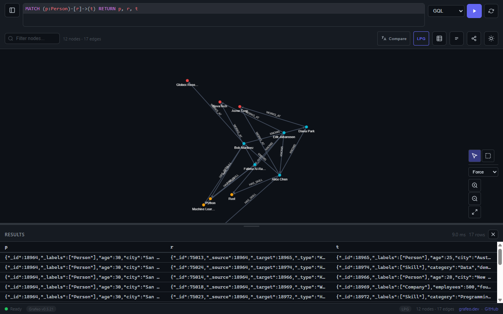

[](https://github.com/GrafeoDB/grafeo/actions/workflows/ci.yml)
[](https://github.com/GrafeoDB/grafeo/actions/workflows/docs.yml)
[](https://codecov.io/gh/GrafeoDB/grafeo)
[](https://crates.io/crates/grafeo)
[](https://pypi.org/project/grafeo/)
[](https://www.npmjs.com/package/@grafeo-db/js)
[](https://www.npmjs.com/package/@grafeo-db/wasm)
[](https://www.nuget.org/packages/Grafeo)
[](https://pub.dev/packages/grafeo)
[](https://www.npmjs.com/package/@grafeo-db/web)
[](https://pkg.go.dev/github.com/GrafeoDB/grafeo/crates/bindings/go)
[](https://hub.docker.com/r/grafeo/grafeo-server)
[](LICENSE)
[](https://www.rust-lang.org)
[](https://www.python.org)

# Grafeo — Cognitive Graph Database

Grafeo is a **cognitive graph database** — a high-performance graph engine with built-in reactive intelligence. Beyond storing and querying graph data, Grafeo continuously reasons about its own topology: nodes carry **energy** that decays over time, edges form **Hebbian synapses** that strengthen with co-activation, and a **knowledge fabric** scores every node for risk, staleness, and structural importance.

This means your graph isn't just data — it's a living system that remembers what matters, forgets what doesn't, and surfaces insights automatically.

On the [LDBC Social Network Benchmark](https://github.com/GrafeoDB/graph-bench), Grafeo is the fastest tested graph database in both embedded and server configurations, while using a fraction of the memory.

[](https://grafeo.ai)

## Overview

Traditional graph databases store nodes and edges, then wait for you to ask questions. Grafeo does more:

| Traditional Graph DB | Grafeo (Cognitive Graph DB) |
|---------------------|----------------------------|
| Static storage | **Reactive** — mutations trigger cognitive updates |
| Edges are inert | **Synapses** — edges strengthen with use, decay without it |
| Nodes are passive | **Energy** — nodes have activation levels that decay exponentially |
| Manual analysis | **Fabric** — continuous risk, staleness, and centrality scoring |
| No memory of errors | **Scars** — persistent memory of failures that influence risk |
| Uniform importance | **Spreading activation** — query one node, discover related hot zones |

Grafeo supports **Labeled Property Graph (LPG)** and **Resource Description Framework (RDF)** data models, all major query languages (GQL, Cypher, SPARQL, Gremlin, GraphQL, SQL/PGQ), and embeds with zero external dependencies.

## Quick Start

### Rust

```bash
cargo add grafeo
```

```rust
use grafeo::GrafeoDB;

fn main() {
    let db = GrafeoDB::new_in_memory();
    let session = db.session();

    // Build a graph
    session.execute("INSERT (:Person {name: 'Alix', age: 30})").unwrap();
    session.execute("INSERT (:Person {name: 'Gus', age: 25})").unwrap();
    session.execute(
        "MATCH (a:Person {name: 'Alix'}), (b:Person {name: 'Gus'})
         INSERT (a)-[:KNOWS {since: 2020}]->(b)"
    ).unwrap();

    // Query it
    let result = session.execute(
        "MATCH (p:Person)-[:KNOWS]->(friend)
         RETURN p.name, friend.name"
    ).unwrap();
    for row in result.iter() {
        println!("{} knows {}", row[0], row[1]);
    }

    // Run graph algorithms
    let pr = session.execute("CALL grafeo.pagerank()").unwrap();
    for row in pr.iter() {
        println!("Node {} — PageRank {:.4}", row[0], row[1]);
    }
}
```

### Python

```bash
uv add grafeo
```

```python
import grafeo

db = grafeo.GrafeoDB()
db.execute("INSERT (:Person {name: 'Alix', age: 30})")
db.execute("INSERT (:Person {name: 'Gus', age: 25})")
db.execute("""
    MATCH (a:Person {name: 'Alix'}), (b:Person {name: 'Gus'})
    INSERT (a)-[:KNOWS {since: 2020}]->(b)
""")

result = db.execute("MATCH (p:Person)-[:KNOWS]->(f) RETURN p.name, f.name")
for row in result:
    print(row)
```

### Node.js

```bash
npm install @grafeo-db/js
```

```js
const { GrafeoDB } = require('@grafeo-db/js');
const db = await GrafeoDB.create();

await db.execute("INSERT (:Person {name: 'Alix', age: 30})");
await db.execute("INSERT (:Person {name: 'Gus', age: 25})");
await db.execute(`
    MATCH (a:Person {name: 'Alix'}), (b:Person {name: 'Gus'})
    INSERT (a)-[:KNOWS {since: 2020}]->(b)
`);

const result = await db.execute(`
    MATCH (p:Person)-[:KNOWS]->(friend)
    RETURN p.name, friend.name
`);
console.log(result.rows);
await db.close();
```

## Cognitive Primitives

Grafeo's cognitive layer operates on four core primitives that work together to create a self-aware graph:

### Energy

Every node carries an **energy** value that represents its current activation level. Energy decays exponentially over time following a configurable half-life:

```
E(t) = E₀ × 2^(-Δt / half_life)
```

- **Boost on mutation**: each INSERT/UPDATE to a node increases its energy
- **Exponential decay**: unused nodes naturally fade toward zero
- **Structural reinforcement**: highly connected nodes decay more slowly (degree-modulated half-life)
- **Normalized score**: `energy_score(e) = 1 - exp(-e / ref_energy)` maps to [0, 1]

Energy lets you distinguish *active* parts of your graph from *stale* ones — without timestamps or manual bookkeeping.

### Synapse

Edges between nodes can form **Hebbian synapses** — connections that strengthen when both endpoints are activated together (co-accessed, co-mutated, co-queried):

```
W(t) = W₀ × 2^(-Δt / half_life) + reinforcements
```

- **Hebbian learning**: "neurons that fire together wire together"
- **Competitive normalization**: when total outgoing weight exceeds a threshold, all weights are scaled down — like biological synaptic competition
- **Pruning**: synapses below a minimum weight are automatically removed
- **Spreading activation**: energy propagates through synapses via BFS, attenuating with distance

Synapses let the graph learn which connections *matter* based on actual usage patterns.

### Scar

When something goes wrong — a failed transaction, a rollback, an integrity violation — Grafeo records a **scar** on the affected nodes:

```
I(t) = I₀ × 2^(-Δt / half_life)
```

- **Persistent error memory**: scars fade but don't immediately disappear
- **Risk influence**: scar intensity feeds into the fabric risk score
- **Per-node limit**: configurable maximum scars per node (oldest pruned first)

Scars ensure the graph *remembers* past problems, making previously-failed areas more cautious.

### Fabric

The **knowledge fabric** is the integration layer that combines all cognitive signals into actionable scores for every node:

| Metric | Source | Description |
|--------|--------|-------------|
| `mutation_frequency` | Reactive listener | How often this node changes |
| `annotation_density` | External input | Coverage of documentation/metadata |
| `staleness` | Time since last mutation | How long since anything happened |
| `pagerank` | GDS refresh | Structural importance in the graph |
| `betweenness` | GDS refresh | How often this node is on shortest paths |
| `scar_intensity` | Scar store | Accumulated error memory |
| `community_id` | Louvain | Which community this node belongs to |
| **`risk_score`** | **Weighted composite** | **Single 0–1 score: how "risky" is this node?** |

Risk is computed as:

```
risk = w₁×pagerank + w₂×mutation_frequency + w₃×annotation_gap + w₄×betweenness + w₅×scar
```

Default weights: 0.25, 0.25, 0.20, 0.15, 0.15 (configurable via `RiskWeights`).

## GDS Algorithms

Grafeo includes a full Graph Data Science (GDS) library, accessible via `CALL` procedures or the Rust API:

### Centrality
| Algorithm | Procedure | Description |
|-----------|-----------|-------------|
| PageRank | `grafeo.pagerank()` | Link-based importance scoring |
| Betweenness | `grafeo.betweenness_centrality()` | Shortest-path intermediary frequency |
| Closeness | `grafeo.closeness_centrality()` | Average distance to all other nodes |
| Degree | `grafeo.degree_centrality()` | In/out/total degree counts |
| HITS | `grafeo.hits()` | Hub and authority scores |

### Community Detection
| Algorithm | Procedure | Description |
|-----------|-----------|-------------|
| Louvain | `grafeo.louvain()` | Modularity-optimizing community detection |
| Leiden | `grafeo.leiden()` | Improved Louvain with guaranteed connectivity |
| Label Propagation | `grafeo.label_propagation()` | Fast distributed community labeling |

### Shortest Paths
| Algorithm | Procedure | Description |
|-----------|-----------|-------------|
| Dijkstra | `grafeo.dijkstra()` | Single-source shortest paths |
| Bellman-Ford | `grafeo.bellman_ford()` | Handles negative weights |
| A* | `grafeo.astar()` | Heuristic-guided search |
| Floyd-Warshall | `grafeo.floyd_warshall()` | All-pairs shortest paths |

### Traversal & Structure
| Algorithm | Procedure | Description |
|-----------|-----------|-------------|
| BFS/DFS | `grafeo.bfs()` / `grafeo.dfs()` | Graph traversal |
| Connected Components | `grafeo.connected_components()` | Component membership |
| SCC | `grafeo.strongly_connected_components()` | Strongly connected components |
| Topological Sort | `grafeo.topological_sort()` | DAG ordering |
| Bridges | `grafeo.bridges()` | Critical edges |
| Articulation Points | `grafeo.articulation_points()` | Critical nodes |
| K-Core | `grafeo.k_core()` | K-core decomposition |

### Clustering & Similarity
| Algorithm | Procedure | Description |
|-----------|-----------|-------------|
| Clustering Coefficient | `grafeo.clustering_coefficient()` | Local clustering density |
| Triangle Count | `grafeo.triangle_count()` | Per-node triangle enumeration |
| Jaccard | `grafeo.jaccard()` | Neighbor overlap similarity |
| Cosine Similarity | `grafeo.cosine_similarity()` | Angular distance |
| Adamic-Adar | `grafeo.adamic_adar()` | Weighted common neighbors |

### Network Flow & MST
| Algorithm | Procedure | Description |
|-----------|-----------|-------------|
| Max Flow | `grafeo.max_flow()` | Ford-Fulkerson / push-relabel |
| Min-Cost Max Flow | `grafeo.min_cost_max_flow()` | Cost-optimized flow |
| Kruskal | `grafeo.kruskal()` | Minimum spanning tree |
| Prim | `grafeo.prim()` | Alternative MST |

## CALL Procedures Reference

### Syntax

```sql
-- Basic call
CALL grafeo.pagerank()

-- With parameters
CALL grafeo.pagerank({damping: 0.85, max_iterations: 20})

-- With YIELD to select columns
CALL grafeo.louvain() YIELD node_id, community_id

-- With aliases
CALL grafeo.pagerank() YIELD node_id AS id, score AS rank
```

### Standard GDS Procedures

All GDS algorithms are exposed as `CALL grafeo.<algorithm>()` procedures. See the [GDS Algorithms](#gds-algorithms) section for the full list.

### Cognitive Procedures

These procedures access the cognitive subsystems at query time:

| Procedure | Description | Columns |
|-----------|-------------|---------|
| `grafeo.cognitive.spread(node_id, {hops: N})` | Spreading activation from a source node | `activated`, `energy` |
| `grafeo.cognitive.distill({min_weight: 0.1})` | Extract high-weight synaptic connections | `artifact` |

### Cognitive UDFs (User-Defined Functions)

Cognitive functions can be used inline in any GQL expression:

| Function | Description | Returns |
|----------|-------------|---------|
| `grafeo.energy(node_id)` | Current energy (activation level) of a node | `Float64` |
| `grafeo.risk(node_id)` | Composite risk score from the knowledge fabric | `Float64` |
| `grafeo.synapses(node_id)` | List of Hebbian synapses connected to a node | `List<Map>` |

```sql
-- Find high-energy nodes
MATCH (n:Person)
WHERE grafeo.energy(ID(n)) > 0.5
RETURN n.name, grafeo.energy(ID(n)) AS energy

-- Find risky nodes
MATCH (n)
RETURN n, grafeo.risk(ID(n)) AS risk
ORDER BY risk DESC
LIMIT 10

-- Inspect synaptic connections
MATCH (n:Concept {name: 'GraphDB'})
RETURN grafeo.synapses(ID(n)) AS connections
```

## MCP Server

Grafeo exposes its full capabilities — queries, graph algorithms, cognitive features — through the [Model Context Protocol (MCP)](https://modelcontextprotocol.io):

```bash
npm install -g @grafeo-db/mcp
```

The MCP server lets LLM agents:
- Execute GQL/Cypher/SPARQL queries against a Grafeo instance
- Run graph algorithms (PageRank, community detection, shortest paths)
- Access cognitive features (energy, synapses, spreading activation)
- Inspect schema, stats, and graph structure

See [grafeo-mcp](https://github.com/GrafeoDB/grafeo-mcp) for configuration and usage.

## Architecture

```
┌──────────────────────────────────────────────────────────────────┐
│                        Query Languages                          │
│   GQL │ Cypher │ SPARQL │ Gremlin │ GraphQL │ SQL/PGQ           │
├──────────────────────────────────────────────────────────────────┤
│                      Query Engine                               │
│   Parser → AST → Logical Plan → Optimizer → Physical Plan       │
│   Push-based vectorized execution │ Morsel-driven parallelism   │
├──────────────────────────────────────────────────────────────────┤
│                     Graph Storage                               │
│   LPG Store (CSR adjacency)  │  RDF Store (SPO/POS/OSP)        │
│   MVCC Transactions          │  Snapshot Isolation              │
│   Columnar + compressed      │  WAL + checkpoint               │
├──────────────────────────────────────────────────────────────────┤
│                    Reactive Layer                                │
│   InstrumentedStore → MutationBus → Scheduler → Listeners       │
│   Zero-cost when no subscribers (<5μs overhead)                 │
├──────────────────────────────────────────────────────────────────┤
│                   Cognitive Layer                                │
│   ┌──────────┐ ┌──────────┐ ┌──────────┐ ┌──────────┐          │
│   │  Energy   │ │ Synapse  │ │  Scar    │ │  Fabric  │          │
│   │  Store    │ │  Store   │ │  Store   │ │  Store   │          │
│   └──────────┘ └──────────┘ └──────────┘ └──────────┘          │
│   Spreading Activation │ Co-Change Detection │ Stagnation       │
│   GDS Refresh (PageRank, Louvain, Betweenness) │ Memory Mgmt   │
├──────────────────────────────────────────────────────────────────┤
│                    Index Layer                                  │
│   HNSW (vectors) │ BM25 (text) │ Bloom filters │ Zone maps     │
├──────────────────────────────────────────────────────────────────┤
│                   Bindings & Integrations                       │
│   Python │ Node.js │ Go │ C │ C# │ Dart │ WASM │ MCP           │
└──────────────────────────────────────────────────────────────────┘
```

### Reactive Pipeline

Every mutation flows through the reactive pipeline:

```
INSERT/UPDATE/DELETE
        ↓
InstrumentedStore (transparent wrapper)
        ↓ buffers events
MutationBus (tokio::broadcast)
        ↓ publishes MutationBatch
Scheduler (batches, dispatches)
        ↓
┌───────────┬───────────┬───────────┬────────────┐
│  Energy   │  Synapse  │  Fabric   │  Co-Change │
│ Listener  │ Listener  │ Listener  │  Detector  │
└───────────┴───────────┴───────────┴────────────┘
        ↓
Cognitive stores updated → risk recalculated
```

## Features

### Core Capabilities

- **Dual data model support**: LPG and RDF with optimized storage for each
- **Multi-language queries**: GQL, Cypher, Gremlin, GraphQL, SPARQL and SQL/PGQ
- Embeddable with zero external dependencies — no JVM, no Docker, no external processes
- **Multi-language bindings**: Python (PyO3), Node.js/TypeScript (napi-rs), Go (CGO), C (FFI), C# (.NET 8 P/Invoke), Dart (dart:ffi), WebAssembly (wasm-bindgen)
- In-memory and persistent storage modes
- MVCC transactions with snapshot isolation

### Vector Search & AI

- **Vector as a first-class type**: `Value::Vector(Arc<[f32]>)` stored alongside graph data
- **HNSW index**: O(log n) approximate nearest neighbor search with tunable recall
- **Distance functions**: Cosine, Euclidean, Dot Product, Manhattan (SIMD-accelerated: AVX2, SSE, NEON)
- **Vector quantization**: Scalar (f32 → u8), Binary (1-bit) and Product Quantization (8-32x compression)
- **BM25 text search**: Full-text inverted index with Unicode tokenizer and stop word removal
- **Hybrid search**: Combined text + vector search with Reciprocal Rank Fusion (RRF) or weighted fusion
- **Memory-mapped storage**: Disk-backed vectors with LRU cache for large datasets

### Performance Features

- **Push-based vectorized execution** with adaptive chunk sizing
- **Morsel-driven parallelism** with auto-detected thread count
- **Columnar storage** with dictionary, delta and RLE compression
- **Cost-based optimizer** with DPccp join ordering and histograms
- **Zone maps** for intelligent data skipping (including vector zone maps)
- **Adaptive query execution** with runtime re-optimization
- **Transparent spilling** for out-of-core processing

### Benchmarks

Tested with the [LDBC Social Network Benchmark](https://ldbcouncil.org/benchmarks/snb/) via [graph-bench](https://github.com/GrafeoDB/graph-bench):

**Embedded** (SF0.1, in-process):

| Database | SNB Interactive | Memory | Graph Analytics | Memory |
|----------|---------------:|-------:|----------------:|-------:|
| **Grafeo** | **2,904 ms** | 136 MB | **0.4 ms** | 43 MB |
| LadybugDB(Kuzu) | 5,333 ms | 4,890 MB | 225 ms | 250 MB |
| FalkorDB Lite | 7,454 ms | 156 MB | 89 ms | 88 MB |

**Server** (SF0.1, over network):

| Database | SNB Interactive | Graph Analytics |
|----------|---------------:|----------------:|
| **Grafeo Server** | **730 ms** | **15 ms** |
| Memgraph | 4,113 ms | 19 ms |
| Neo4j | 6,788 ms | 253 ms |
| ArangoDB | 40,043 ms | 22,739 ms |

Full results: [embedded](https://github.com/GrafeoDB/graph-bench/blob/main/RESULTS_EMBEDDED.md) | [server](https://github.com/GrafeoDB/graph-bench/blob/main/RESULTS_SERVER.md)

## Installation

### Rust

```bash
cargo add grafeo
```

By default, the `embedded` profile is enabled: GQL, AI features (vector/text/hybrid search, CDC), graph algorithms and parallel execution. Use feature groups to customize:

```bash
# Default (embedded profile): GQL + AI + algorithms + parallel
cargo add grafeo

# All query languages + AI + algorithms + storage
cargo add grafeo --no-default-features --features full

# Only GQL with AI features
cargo add grafeo --no-default-features --features gql,ai

# Minimal: GQL only
cargo add grafeo --no-default-features --features gql

# With graph algorithms (SSSP, PageRank, centrality, community detection, etc.)
cargo add grafeo --no-default-features --features gql,algos
```

### Python

```bash
uv add grafeo
```

### Node.js / TypeScript

```bash
npm install @grafeo-db/js
```

### Go

```bash
go get github.com/GrafeoDB/grafeo/crates/bindings/go
```

### WebAssembly

```bash
npm install @grafeo-db/wasm
```

### C# / .NET

```bash
dotnet add package Grafeo
```

### Dart

```yaml
# pubspec.yaml
dependencies:
  grafeo: ^0.5.24
```

## Examples

Standalone examples demonstrating cognitive graph database use cases:

| Example | Description | Run |
|---------|-------------|-----|
| [Social Network](examples/rust/social_network.rs) | Energy decay on interactions, community detection, spreading activation | `cargo run -p grafeo-examples --bin social_network` |
| [Knowledge Base](examples/rust/knowledge_base.rs) | Synapse reinforcement, multi-signal search, stale node consolidation | `cargo run -p grafeo-examples --bin knowledge_base` |
| [IoT Stream](examples/rust/iot_stream.rs) | Co-change detection on sensor events, stagnation alerting | `cargo run -p grafeo-examples --bin iot_stream` |
| [Basic](examples/rust/basic.rs) | Create a social graph and query it | `cargo run -p grafeo-examples --bin basic` |
| [Algorithms](examples/rust/algorithms.rs) | PageRank, Louvain, degree centrality via CALL procedures | `cargo run -p grafeo-examples --bin algorithms` |
| [Vector Search](examples/rust/vector_search.rs) | HNSW index, cosine similarity, hybrid search | `cargo run -p grafeo-examples --bin vector_search` |
| [Transactions](examples/rust/transactions.rs) | ACID transactions with snapshot isolation | `cargo run -p grafeo-examples --bin transactions` |

## Ecosystem

| Project | Description |
|---------|-------------|
| [**grafeo-server**](https://github.com/GrafeoDB/grafeo-server) | HTTP server & web UI: REST API, transactions, single binary (~40MB Docker image) |
| [**grafeo-web**](https://github.com/GrafeoDB/grafeo-web) | Browser-based Grafeo via WebAssembly with IndexedDB persistence |
| [**gwp**](https://github.com/GrafeoDB/gql-wire-protocol) | GQL Wire Protocol: gRPC wire protocol for GQL (ISO/IEC 39075) with client bindings in 5 languages |
| [**boltr**](https://github.com/GrafeoDB/boltr) | Bolt Wire Protocol: pure Rust Bolt v5.x implementation for Neo4j driver compatibility |
| [**grafeo-langchain**](https://github.com/GrafeoDB/grafeo-langchain) | LangChain integration: graph store, vector store, Graph RAG retrieval |
| [**grafeo-llamaindex**](https://github.com/GrafeoDB/grafeo-llamaindex) | LlamaIndex integration: PropertyGraphStore, vector search, knowledge graphs |
| [**grafeo-mcp**](https://github.com/GrafeoDB/grafeo-mcp) | Model Context Protocol server: expose Grafeo as tools for LLM agents |
| [**grafeo-memory**](https://github.com/GrafeoDB/grafeo-memory) | AI memory layer for LLM applications: fact extraction, deduplication, semantic search |
| [**anywidget-graph**](https://github.com/GrafeoDB/anywidget-graph) | Interactive graph visualization for Python notebooks (Marimo, Jupyter, VS Code, Colab) |
| [**anywidget-vector**](https://github.com/GrafeoDB/anywidget-vector) | 3D vector/embedding visualization for Python notebooks |
| [**playground**](https://grafeo.ai) | Interactive browser playground: query in 6 languages, visualize graphs, explore schemas |
| [**graph-bench**](https://github.com/GrafeoDB/graph-bench) | Benchmark suite comparing graph databases across 25+ benchmarks |
| [**ann-benchmarks**](https://github.com/GrafeoDB/ann-benchmarks) | Fork of ann-benchmarks with a Grafeo HNSW adapter for vector search benchmarking |

## Documentation

Full documentation is available at [grafeo.dev](https://grafeo.dev).

## Contributing

See [CONTRIBUTING.md](CONTRIBUTING.md) for development setup and guidelines.

## Acknowledgments

Grafeo's execution engine draws inspiration from:

- [DuckDB](https://duckdb.org/), vectorized push-based execution, morsel-driven parallelism
- [Kuzu](https://github.com/kuzudb/kuzu), CSR-based adjacency indexing, factorized query processing

## License

Apache-2.0
