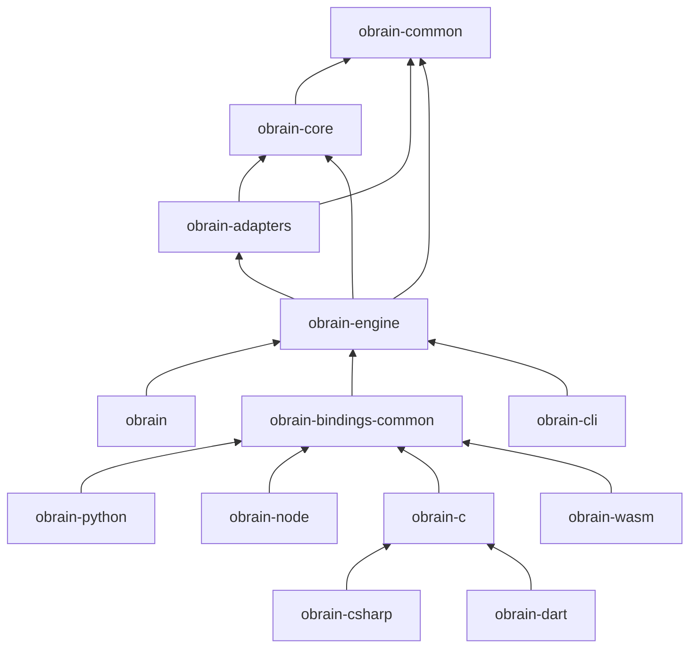

# Crate Structure

Obrain is organized into core library crates and language binding crates.

## Dependency Graph



## obrain

Top-level facade crate that re-exports the public API.

| Module | Purpose |
|--------|---------|
| `lib.rs` | Re-exports from obrain-engine |

```rust
use obrain::ObrainDB;

let db = ObrainDB::new_in_memory();
```

## obrain-common

Foundation types and utilities.

| Module | Purpose |
|--------|---------|
| `types/` | NodeId, EdgeId, Value, LogicalType |
| `memory/` | Arena allocator, memory pools |
| `utils/` | Hashing, error types |

```rust
use obrain_common::types::{NodeId, Value};
use obrain_common::memory::Arena;
```

## obrain-core

Core data structures, graph-store traits and execution engine. Since the
T17 substrate cutover, `obrain-core` owns the abstract traits
(`GraphStore`, `GraphStoreMut`) and the query-execution pipeline. The
concrete on-disk backend lives in [obrain-substrate](#obrain-substrate).

| Module | Purpose |
|--------|---------|
| `graph/traits.rs` | `GraphStore` / `GraphStoreMut` traits (canonical API) |
| `graph/lpg/` | Legacy LPG in-memory backend (scheduled for removal in T17 W4) |
| `index/` | Hash, B-tree, adjacency indexes |
| `execution/` | DataChunk, operators, pipelines |

```rust
use obrain_substrate::SubstrateStore;
use obrain_core::graph::traits::GraphStoreMut;
use obrain_core::index::HashIndex;
use obrain_core::execution::DataChunk;

let store = SubstrateStore::open_tempfile().unwrap();
```

## obrain-substrate

Canonical on-disk backend for the obrain graph database — a single mmap'd
file that *is* the topology (records `#[repr(C)]` bytemuck::Pod, inline
index-free adjacency, WAL-native). Implements `GraphStore` /
`GraphStoreMut` as a drop-in replacement for the legacy `LpgStore`.

| Module | Purpose |
|--------|---------|
| `store.rs` | `SubstrateStore` — open / mmap / WAL entry point |
| `record.rs` | Fixed-size `NodeRecord` (32 B) / `EdgeRecord` (36 B post-T17f) |
| `props_zone.rs` | 4 KiB `PropertyPage` mmap-backed property chains |
| `wal/` | Crash-safe WAL (NodeInsert / EdgeInsert / PropSet / Delete / Checkpoint) |
| `tiers/` | Retrieval tiers L0 (128-bit) / L1 (512-bit) / L2 (f16 384-dim) |

```rust
use obrain_substrate::SubstrateStore;

let store = SubstrateStore::open("/path/to/db.obrain").unwrap();
```

## obrain-adapters

External interfaces and adapters.

| Module | Purpose |
|--------|---------|
| `query/gql/` | GQL parser (lexer, parser, AST) |
| `query/cypher/` | Cypher compatibility layer |
| `storage/` | Storage backends (memory, WAL) |
| `plugins/` | Plugin system |

```rust
use obrain_adapters::query::gql::Parser;
use obrain_adapters::storage::wal::WalManager;
```

## obrain-engine

Database facade and coordination.

| Module | Purpose |
|--------|---------|
| `database.rs` | ObrainDB struct, lifecycle |
| `session.rs` | Session management |
| `query/` | Query processor, planner, optimizer |
| `transaction/` | Transaction manager, MVCC |

```rust
use obrain_engine::{ObrainDB, Session, Config};
```

## obrain-python

Python bindings via PyO3. Located at `crates/bindings/python`.

| Module | Purpose |
|--------|---------|
| `database.rs` | PyObrainDB class |
| `query.rs` | Query execution |
| `types.rs` | Type conversions |

```python
import obrain
db = obrain.ObrainDB()
```

## obrain-node

Node.js/TypeScript bindings via napi-rs. Located at `crates/bindings/node`.

| Module | Purpose |
|--------|---------|
| `database.rs` | JsObrainDB class |
| `query.rs` | Query execution and result conversion |
| `types.rs` | JavaScript ↔ Rust type conversions |

```javascript
const { ObrainDB } = require('@obrain-db/js');
const db = await ObrainDB.create();
```

## obrain-c

C FFI layer for cross-language interop. Located at `crates/bindings/c`.

| Module | Purpose |
|--------|---------|
| `lib.rs` | C-compatible function exports |
| `types.rs` | C-safe type wrappers |

Also used by Go (CGO), C# (P/Invoke) and Dart (dart:ffi) bindings.

## obrain-csharp

C# / .NET 8 bindings via source-generated P/Invoke. Located at `crates/bindings/csharp`.

Wraps obrain-c with a .NET-native API including `ObrainDB`, typed CRUD, transactions, vector search and `SafeHandle`-based resource management.

## obrain-dart

Dart bindings via dart:ffi. Located at `crates/bindings/dart`.

Wraps obrain-c with `NativeFinalizer` for automatic resource cleanup, sealed exception hierarchy and `late final` cached FFI lookups.

## obrain-bindings-common

Shared library for all language bindings. Located at `crates/bindings/common`.

| Module | Purpose |
|--------|---------|
| `entities.rs` | Entity extraction (RawNode, RawEdge) |
| `errors.rs` | Error classification |
| `json.rs` | JSON to/from Value conversion |

## obrain-wasm

WebAssembly bindings via wasm-bindgen. Located at `crates/bindings/wasm`.

| Module | Purpose |
|--------|---------|
| `lib.rs` | WASM-compatible database API |
| `types.rs` | JavaScript ↔ WASM type conversions |

```javascript
import init, { Database } from '@obrain-db/wasm';
await init();
const db = new Database();
```

## obrain-cli

Command-line interface for database administration.

| Module | Purpose |
|--------|---------|
| `commands/` | CLI command implementations |
| `output.rs` | Output formatting (table, JSON) |

```bash
obrain info ./mydb
obrain stats ./mydb --format json
```

## Crate Guidelines

1. **No cyclic dependencies** - Strict layering
2. **Public API minimization** - Only expose what's needed
3. **Feature flags** - Optional functionality gated by features
4. **Documentation** - All public items documented
