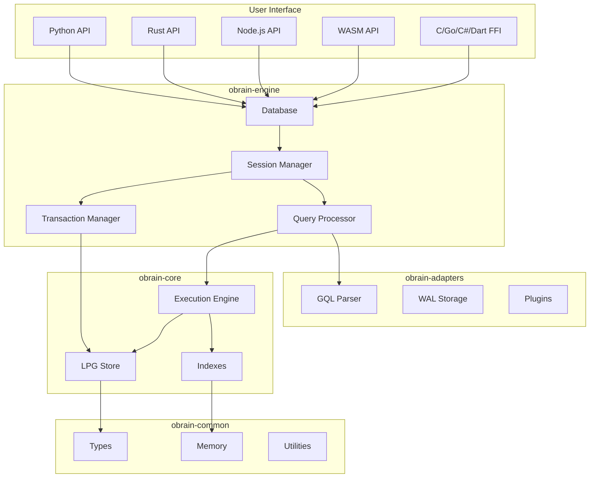

# Architecture

Understand how Obrain is designed and implemented.

## Overview

Obrain is built as a modular system with clear separation of concerns:

## Sections

-   **[System Overview](overview.md)**

    ---

    High-level architecture, design principles and query flow.

-   **[Crate Structure](crates.md)**

    ---

    The crates and their responsibilities.

-   **[Storage Model](storage/index.md)**

    ---

    Columnar properties, chunked adjacency lists, compression.

-   **[Execution Engine](execution/index.md)**

    ---

    Push-based vectorized execution and parallelism.

-   **[Query Optimization](optimization/index.md)**

    ---

    Cost-based optimization, join ordering, cardinality estimation.

-   **[Memory Management](memory/index.md)**

    ---

    Buffer manager, arena allocators, spill-to-disk.

-   **[Transactions](transactions/index.md)**

    ---

    MVCC, snapshot isolation, conflict detection.

## Design Principles

1. **Performance First** - Batch-at-a-time vectorized execution, columnar storage, morsel-driven parallelism
2. **Embeddable** - No required C dependencies, single library
3. **Safe** - Written in safe Rust, memory-safe by design
4. **Modular** - Clear crate boundaries, strict layering
5. **Extensible** - Plugin architecture, multiple storage backends
