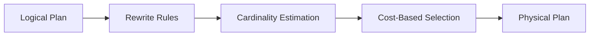

# Query Optimization

Grafeo uses cost-based optimization to select efficient query plans.

## Optimizer Pipeline



## Cost Model

The cost model estimates execution cost for plan selection.

| Component | Weight | Description |
| --------- | ------ | ----------- |
| CPU | 1.0 | Computation cost |
| I/O | 10.0 | Disk access cost |
| Memory | 0.5 | Memory allocation |

```text
Total Cost = CPU_cost * cpu_weight
           + IO_cost * io_weight
           + Mem_cost * mem_weight
```

| Operator | Cost Formula |
| -------- | ------------ |
| Scan | rows * column_count |
| Filter | input_rows * selectivity |
| Hash Join | build_rows + probe_rows |
| Sort | rows * log(rows) |

The cost model uses real fanout derived from graph statistics (average degree, label cardinalities, edge-type frequencies) instead of hardcoded defaults. This leads to better plan selection for traversal-heavy queries, especially on graphs with skewed degree distributions.

## Cardinality Estimation

Accurate cardinality estimation is crucial for plan selection.

| Statistic | Purpose |
| --------- | ------- |
| Element count | Base cardinality (nodes/edges per label) |
| Distinct count | Join estimation |
| Histograms | Range selectivity |
| Null fraction | Null handling |

```text
// Equality predicate
selectivity = 1 / distinct_count

// Range predicate
selectivity = (high - low) / (max - min)

// Join
output_rows = (rows_a * rows_b) / max(distinct_a, distinct_b)
```

Statistics are collected automatically by the query engine during graph operations. Grafeo tracks per-label and per-property statistics for cardinality estimation.

## Join Ordering (DPccp)

Graph pattern matching translates to multi-way joins (one per edge in the pattern). DPccp (Dynamic Programming connected complement pairs) efficiently enumerates only connected subgraph pairs, pruning the exponential search space while guaranteeing an optimal join order. Greedy algorithms miss better plans; exhaustive DP is too slow for large patterns. DPccp hits the sweet spot.

For n relations, the number of possible join orders grows explosively:

| Relations | Possible Orders |
| --------- | --------------- |
| 3 | 12 |
| 5 | 1,680 |
| 10 | ~17 billion |

DPccp works by:

1. Enumerating all connected subgraphs
2. Finding the optimal join for each subgraph
3. Building larger plans from smaller optimal plans
4. Pruning dominated plans

### Join Type Selection

| Join Type | Best When |
| --------- | --------- |
| Hash Join | Large inputs, equality predicates |
| Nested Loop | Small inner, indexed |
| Merge Join | Sorted inputs |
