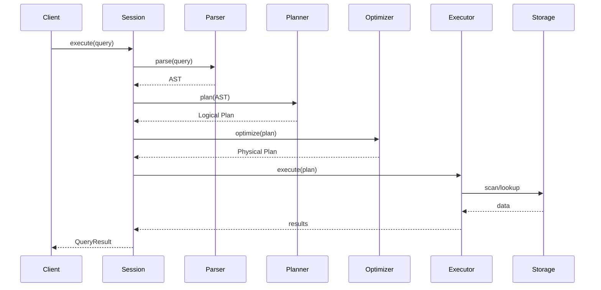

# System Overview

Obrain is designed as a high-performance, embeddable graph database.

## Design Goals

| Goal | Approach |
|------|----------|
| **Performance** | Batch-at-a-time vectorized execution, columnar storage |
| **Embeddability** | No required C dependencies, single library |
| **Safety** | Pure Rust, memory-safe by design |
| **Flexibility** | Plugin architecture, multiple storage backends |

## Query Flow

## Key Components

### Query Processing

1. **Parser** - GQL/Cypher/SPARQL/Gremlin/GraphQL/SQL-PGQ to AST
2. **Binder** - Semantic analysis and type checking
3. **Planner** - AST to logical plan
4. **Optimizer** - Cost-based optimization
5. **Executor** - Push-based execution

### Storage

Obrain uses **SubstrateStore** (`obrain-substrate`) as its primary storage
backend — a single mmap'd file where the topology *is* the storage
(topology-as-storage). See [RFC-SUBSTRATE](../rfc/substrate/format-spec.md)
and the [MIGRATION guide](../../MIGRATION.md) for details.

1. **SubstrateStore** — 32 B node records + 30 B edge records, WAL-native,
   index-free adjacency (inline linked lists), column-inline cognitive
   state (`energy`, `scar_util_affinity`, `community_id`, synapse
   `weight_u16`).
2. **Embedding Tiers L0 / L1 / L2** — 128-bit binary scan, 512-bit
   Hamming re-rank, f16 cosine top-K. Replaces HNSW; preserves recall ≥ 99 %.
3. **Property Pages** — 4 KiB mmap'd pages, chain-walked per node/edge.
4. **WAL** — durable by construction; every mutation flushes before the
   mmap update (crash-safe, replay on open).
5. **Thinkers** — auto-started background maintainers: LDleiden
   incremental community detection, Hilbert page compaction, Ricci-Ollivier
   curvature, heat-kernel diffusion.

### Memory

1. **Buffer Manager** - Unified memory budget (75% of system RAM by default)
2. **Arena Allocator** - Epoch-based bulk allocation for query execution
3. **Spill Manager** - Disk spilling for large operations

## Threading Model

- **Main Thread** - Coordinates query execution
- **Worker Threads** - Parallel query processing (morsel-driven)
- **Background Thread** - Checkpointing, compaction
