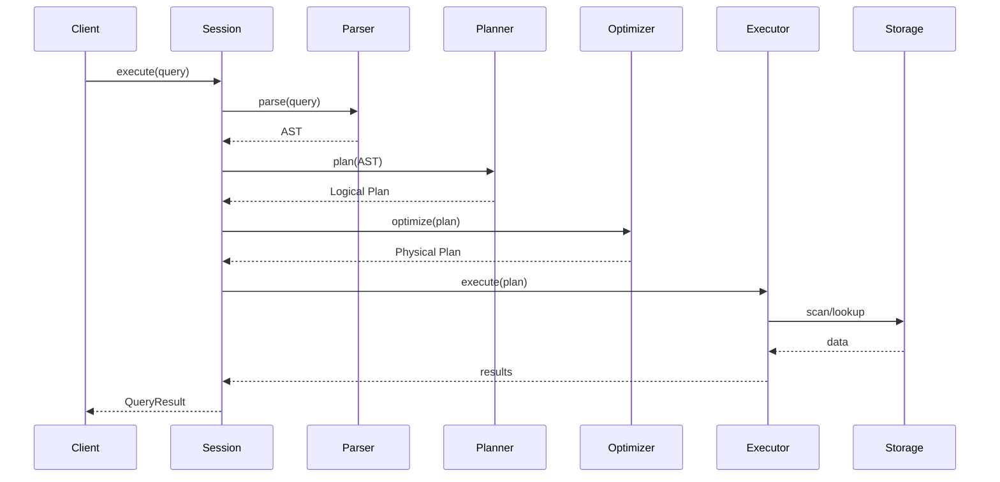

# System Overview

Grafeo is designed as a high-performance, embeddable graph database.

## Design Goals

| Goal | Approach |
|------|----------|
| **Performance** | Batch-at-a-time vectorized execution, columnar storage |
| **Embeddability** | No required C dependencies, single library |
| **Safety** | Pure Rust, memory-safe by design |
| **Flexibility** | Plugin architecture, multiple storage backends |

## Query Flow

## Key Components

### Query Processing

1. **Parser** - GQL/Cypher/SPARQL/Gremlin/GraphQL/SQL-PGQ to AST
2. **Binder** - Semantic analysis and type checking
3. **Planner** - AST to logical plan
4. **Optimizer** - Cost-based optimization
5. **Executor** - Push-based execution

### Storage

1. **LPG Store** - Node and edge storage
2. **Property Store** - Columnar property storage
3. **Indexes** - Hash, adjacency, trie, vector (HNSW), text (BM25), ring
4. **WAL** - Durability and recovery

### Memory

1. **Buffer Manager** - Unified memory budget (75% of system RAM by default)
2. **Arena Allocator** - Epoch-based bulk allocation for query execution
3. **Spill Manager** - Disk spilling for large operations

## Threading Model

- **Main Thread** - Coordinates query execution
- **Worker Threads** - Parallel query processing (morsel-driven)
- **Background Thread** - Checkpointing, compaction
