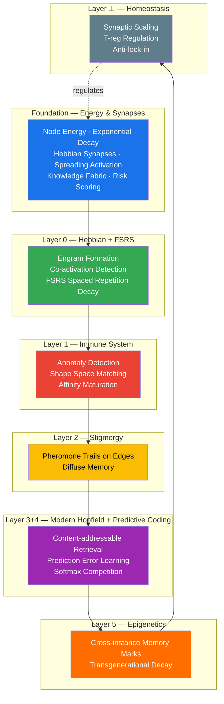

# What is a Cognitive Graph Database?

A **Cognitive Graph Database** is a graph database augmented with biomimetic memory mechanisms. Where a traditional graph DB stores nodes and edges passively, a cognitive graph DB **remembers what matters, forgets what doesn't, and learns from usage patterns** — automatically.

Obrain implements this via seven layered subsystems that react to every mutation and query in real-time.

## The 7 Cognitive Layers



## Cognitive vs Traditional Graph Database

| Feature | Traditional Graph DB | Obrain Cognitive Graph DB |
|---------|---------------------|--------------------------|
| **Memory model** | Static storage — all data equal | Living memory — energy decays, active nodes survive |
| **Edge learning** | Edges are user-created | Synapses form automatically via co-activation (Hebbian) |
| **Retrieval** | Query-driven (you ask, it answers) | Associative recall — partial cues retrieve full memory traces |
| **Relevance** | Manual ranking or PageRank | Spreading activation + energy + synapse strength |
| **Forgetting** | Manual deletion | Natural decay (FSRS) — unused knowledge fades gracefully |
| **Anomaly detection** | External tool required | Built-in immune system (shape space matching) |
| **Risk awareness** | None | Knowledge fabric with composite risk scoring |
| **Cross-instance memory** | None | Epigenetic marks propagate knowledge across instances |

## How It Works — The Reactive Substrate

Every cognitive subsystem implements `MutationListener` and reacts asynchronously to graph mutations:

```text
MutationBus (obrain-reactive)
      │
  Scheduler → dispatches batches to:
      │
      ├── EnergyListener    — tracks node activation energy
      ├── SynapseListener   — Hebbian co-activation learning
      ├── FabricListener    — knowledge density & risk scoring
      ├── CoChangeDetector  — temporal coupling detection
      ├── EngramManager     — memory trace formation
      └── ...               — more cognitive subsystems
```

No extra setup required — enable the `cognitive-full` feature flag and every mutation automatically feeds the cognitive layer.

## Feature Flags

Obrain's cognitive capabilities are modular via Cargo feature flags:

| Flag | What it enables |
|------|----------------|
| `energy` | Node energy with exponential decay and boost |
| `synapse` | Hebbian synapse learning + spreading activation |
| `fabric` | Knowledge fabric metrics + risk scoring |
| `co-change` | Temporal coupling detection |
| `engram` | Engram formation, recall, FSRS decay, crystallization |
| `immune` | Anomaly detection via shape space |
| `stigmergy` | Pheromone trails on edges |
| `epigenetic` | Cross-instance memory marks |
| `cognitive` | Convenience: `energy` + `synapse` |
| `cognitive-fabric` | Convenience: `cognitive` + `fabric` + `co-change` + `gds-refresh` |
| `cognitive-full` | All subsystems |

## Next Steps

<div class="grid cards" markdown>

-   :material-lightning-bolt: [**Energy & Decay**](energy.md)

    How node energy decays exponentially and gets boosted on activation.

-   :material-connection: [**Synapses**](synapses.md)

    Hebbian learning and spreading activation through the graph.

-   :material-brain: [**Engrams**](engrams.md)

    Memory trace formation, Hopfield recall, and FSRS scheduling.

-   :material-web: [**Knowledge Fabric**](fabric.md)

    Risk scoring, community detection, and annotation density.

-   :material-magnify: [**RAG Pipeline**](rag.md)

    Schema-agnostic retrieval augmented generation.

</div>
