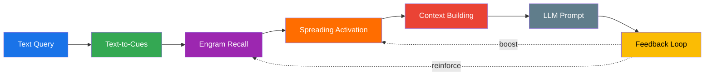

# RAG Pipeline — Schema-Agnostic Retrieval

Obrain includes a built-in **Retrieval Augmented Generation** pipeline that leverages the cognitive layer to produce contextually rich results from any graph schema. No schema configuration required — the retriever reads all string properties automatically.

## Pipeline Overview



## Stage 1 — Text-to-Cues

The query text is tokenized and matched against an **inverted index** built from all graph nodes:

1. **Indexing** — All string properties of all nodes are indexed. Each node gets a TF score: `1.0 + specificity` where `specificity = term_length / text_length`.
2. **Query matching** — Query terms are matched against the index with TF-IDF scoring: `idf(term) = ln(total_nodes / df(term))`.
3. **Label boosting** — Nodes whose labels match query terms get an additional relevance boost, dampened by label cardinality (common labels like `:Person` get less boost than rare ones).

The output is a set of **cue nodes** — graph nodes that textually match the query.

## Stage 2 — Engram Recall

Cue nodes are fed into the **Hopfield recall engine** for content-addressable memory retrieval:

1. **Spectral encoding** — Cue nodes are encoded into a spectral query vector.
2. **Hopfield retrieval** — The query vector is matched against the pattern matrix: $\text{softmax}(\beta \cdot P^T \cdot q) \cdot P$.
3. **MMR diversification** — Results are diversified via Maximal Marginal Relevance to avoid redundancy.
4. **Direct + spectral blend** — Final scores combine direct recall (`direct_recall_weight`) and spectral Hopfield scores (`1 - direct_recall_weight`).

## Stage 3 — Spreading Activation

From the recalled engram ensemble nodes, BFS spreading activation discovers related content:

- Energy propagates through learned synapses, weighted by synapse strength
- Decay factor attenuates energy at each hop
- Circuit breaker limits maximum activated nodes

The result is an `ActivationMap` — every reachable node with its accumulated activation energy.

## Stage 4 — Context Building

Activated nodes are ranked, budget-constrained, and formatted into LLM-consumable markdown:

1. **Diversity-aware ranking** — `rank_with_diversity()` combines activation energy with label diversity to avoid homogeneous results.
2. **Token budgeting** — `select_within_budget()` selects nodes greedily until the token budget is exhausted.
3. **Markdown formatting** — Nodes are grouped by label, with properties (noise-filtered) and relation metadata.

Output:

```rust
RagContext {
    text: String,          // formatted markdown context
    estimated_tokens: usize,
    nodes_included: usize,
    node_ids: Vec<NodeId>,
    node_texts: Vec<String>,
}
```

## Stage 5 — Feedback Loop

After the LLM generates a response, the feedback loop reinforces the cognitive structures:

1. **Concept extraction** — Identifies which context nodes were mentioned in the LLM response.
2. **Hebbian reinforcement** — Synapses between co-mentioned nodes are strengthened by `feedback_reinforce_amount`.
3. **Energy boost** — Nodes that contributed to a useful response get an energy boost of `feedback_energy_boost`.

This creates a virtuous cycle: knowledge that proves useful gets stronger connections and higher energy, making it more likely to be recalled in future queries.

## Presets

Three presets configure the trade-off between speed and comprehensiveness:

### Fast

Best for low-latency queries or resource-constrained environments.

| Parameter | Value |
|-----------|-------|
| `max_engrams` | 5 |
| `min_recall_confidence` | 0.2 |
| `activation_depth` | 1 hop |
| `activation_decay` | 0.3 |
| `max_activated_nodes` | 100 |
| `token_budget` | 1,000 |
| `max_context_nodes` | 10 |

### Balanced (default)

Good for most use cases.

| Parameter | Value |
|-----------|-------|
| `max_engrams` | 10 |
| `min_recall_confidence` | 0.1 |
| `activation_depth` | 2 hops |
| `activation_decay` | 0.5 |
| `max_activated_nodes` | 500 |
| `token_budget` | 2,000 |
| `max_context_nodes` | 30 |

### Thorough

For complex queries where comprehensiveness matters more than speed.

| Parameter | Value |
|-----------|-------|
| `max_engrams` | 30 |
| `min_recall_confidence` | 0.05 |
| `activation_depth` | 3 hops |
| `activation_decay` | 0.6 |
| `max_activated_nodes` | 1,000 |
| `token_budget` | 4,000 |
| `max_context_nodes` | 50 |

## Usage

```rust
use obrain_rag::{RagPipeline, RagConfig, GraphContextBuilder, CognitiveFeedback};

// Create pipeline
let pipeline = RagPipeline::new(
    retriever,                          // Arc<dyn Retriever>
    GraphContextBuilder::new(),          // context builder
    Some(Box::new(CognitiveFeedback::new(
        Some(synapse_store),
        Some(energy_store),
    ))),
    RagConfig::balanced(),               // or ::fast() / ::thorough()
);

// Query
let context = pipeline.query("What projects use plans?")?;

// Inject context.text into LLM prompt...

// After LLM response — close the feedback loop
let stats = pipeline.feedback(&context, &llm_response)?;
```

## Noise Filtering

The context builder automatically filters out noise properties from the output:

- `id`, `uuid`, `_id` — internal identifiers
- `created_at`, `updated_at`, `modified_at` — timestamps

Additional noise properties can be configured via `RagConfig::noise_properties`.

## Incremental Index Updates

The retriever's inverted index supports incremental updates without full rebuilds:

```rust
retriever.index_node(node_id);  // add or update a node
retriever.remove_node(node_id); // remove a node from the index
```
